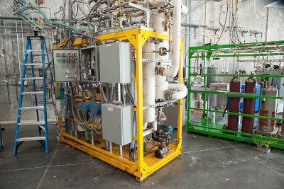

# bope-gpt

 | 

**Brought to you by Ricardo Valencia Albornoz, Yuxin Shen, Sabah Gaznaghi, Clara Tamura, Ratish Panda, Zartashia Afzal and Raul Astudillo**

Youtube video:

Reduced slide set for video:

Full slides by Zartashia Afzal: [Slides]

App prototype developed by [Ratish Panda](https://github.com/imperorrp): [App](https://bope-gpt.vercel.app/)

# The first steps

**Analysing the Fischer-Tropsch dataset from the point of view of classical single and multi-objective BO**

Fischer-Tropsch Synthesis represents a pivotal process in the field of industrial chemistry, serving as a cornerstone for the production of liquid hydrocarbons from carbon monoxide and hydrogen gases. Developed by German chemists Franz Fischer and Hans Tropsch in the early 1920s, this method provides a versatile pathway for converting syngas—a mixture of hydrogen and carbon monoxide derived from coal, biomass, or natural gas—into a variety of valuable hydrocarbon products, including fuels and alkanes. The process is particularly adopted for its ability to produce clean, sulfur-free fuels, which are crucial in today's efforts towards environmental sustainability and energy security. Through catalytic chemical reactions conducted at high temperatures and pressures, Fischer-Tropsch Synthesis offers a strategic approach to mitigating reliance on crude oil by leveraging alternative carbon sources, thereby playing a critical role in the evolving landscape of global energy.

The Fischer-Tropsch synthesis is a chemical reaction that converts a mixture of carbon monoxide (CO) and hydrogen gas (H₂) into liquid hydrocarbons.

$$ n CO + (2n+1) H_2 \rightarrow C_nH_{2n+2} + n H_2O $$

The ground truth we use here is the Artificial Neural Network model built from the dataset in the paper (Chakkingal, Anoop, et al., 2022), with four inputs: space-time (W/FCO), syngas ratio, temperature and pressure, and four outputs: y1 as the carbon monoxide conversion, y2 as the selectivity towards methane (SCH4), y3 as the selectivity towards paraffins (SC2−C4) and y4 as the selectivity towards light olefins (SC2−C4=).

> Maximizing all of the four outputs is desirable for this process. However, in reality some of the three products are considered as byproducts, and the ones you care only achieve high selectivity under very intensive conditions, which are not feasible in technical terms or economical terms. Therefore, we can adjust the objective settings in th BO routine and make the optimization problem more adapted to what would be a real situation.

When you have a ground truth available, classical single objective and multi-objective BO are your start points. These provide useful insight in the nature of each output,i.e, its range, monotonocity, correlations, etc., that are important when working afterwards with preferential Bayesian Optimization.  

**Single-objective BO implementation** 

We conducted [single-objective BO implementation](https://github.com/AC-BO-Hackathon/BOPE-GPT/blob/main/data/singleBO_plots.ipynb) for four different outputs respectively. The model we use is the SingleTaskGP, and qExpectedImprovement is used as the acquisition function.

---

---

---

---

The single-objective BO works quite well, and all four outputs are close to 1 (the upper bound after normalization) following optimization. A problem arises because the optimal input conditions differ for each of the four outputs. Therefore, it is not possible to achieve the optimum for all four outputs simultaneously.

**Multi-objective BO implementation**

We saw that the single-objective BO work quite well when optimizing the four different outputs separately, but the four outputs includes potential trade-offs, and the optimal value cannot be reached at the same time. We then implemented [multi-objective BO](https://github.com/AC-BO-Hackathon/BOPE-GPT/blob/main/data/multiBO_plots.ipynb) to explore the pareto front in the Fischer-Tropsch dataset and identify poteintial trade-offs. We keep the SingleTaskGP as the model, and the qExpectedHypervolumeImprovement as the acquisition function to see the pareto front. By looking at the pairwise comparision of the output pairs, we found for some pairs of the output, the trade-off is quite clear (e.g. output 1 and output 3). However, some of them are hard to identify (e.g. output 3 and output 4).

# Into the preference world

From the multi-objective BO, we observed that the multi-objective optimization result could be a very hard task, since it is often hard *in the field* to have the exact utility function over those objectives, it is much easier for people to make pairwise comparisons. Therefore, we introduced a preference setting to the Fischer-Tropsch problem, and expect the LLM to do the pairwise comparison.

**Decision by a comparison function** 

We first used a comparison function to conduct the decision step and [test the preference setting](https://github.com/AC-BO-Hackathon/BOPE-GPT/blob/main/data/preferentialBO.ipynb). The model we use here is PairwiseGP, and the acquisition function AnalyticExpectedUtilityOfBestOption (EUBO) can help us to find the best observed value under the preference setting.

**Decision by an LLM & Comparison of different objective functions**

Finally we turned to the pairwise comparison by LLM. Basically, we modify the pairwise comparison generation function in the Botorch tutorial section [here](https://botorch.org/tutorials/preference_bo), so that the comparison by utility function can be replaced by the decision of an LLM. The large language model we used was provided by **Cohere**; we are using the Cohere LLM API trial keys that allows us to perform free chat queries to the model with a restriction of 20 API calls/minute and 1000 API/month.

We explored different cases below: ("" means prompt to the LLM, [] indicates objective utility function we tell the EUBO. And we compare the performance of the two results for the optimal values to see if LLM can replace numerical decision)
1. "The four outputs are equally important, and we want to maximize all of them."
[obj: maximize sum of y1-y4]

2. "We only want to maximize the CO conversion."
[obj: maximize y1]

  
3. "The light olefins (y4) is considered as a negative output and we want to minimize y4 while maximizing the other three objectives (y1-y3)."
[obj: maximize y1+y2+y3-y4]

*4. A typo case of the first objective
"The four outputs are equally important, and we want to minimize all of them."
[obj: maximize sum of y1-y4]

From the result of the above three cases, we can see that the LLM is working very well and can identify the requirement of the process by changing the prompts.

To understand how the process work behind the scenes, we can have a look to a sample prompt:

`Suppose you're managing a Fischer-Tropsch synthesis process, Option A: regime of 0.6 CO conversion, 0.0 methane production, 0.1 paraffins, 0.8 light oleffins. Option B: regime of 0.8 CO conversion, 0.1 methane production, 0.2 paraffins, 0.6 light oleffins. Choose only one option, only answer with 'Option A' or 'Option B'`

The numbers from the model output are entered to prompt as strings with one decimal, to simplify the input and provide some fuzziness in the LLM decision (after prompt engineering, we realise that numbers with many decimals are not well intepreted by the Cohere LLM). Now, testing some of the cases before means translating (perhaps subjetively) the utility function into a prompt context that the LLM can take. For case 1 e.g. the equally important outputs means that the utility function is a (equally weighted) linear combination of the outputs, but when applying this in the LLM context for comparison, we need to change the context prompt to something like this: 

`Suppose you're managing a Fischer-Tropsch synthesis process, and you consider that every output of the process is equally important, you have two options, Option A: regime of 0.6 CO conversion, 0.0 methane production, 0.1 paraffins, 0.8 light oleffins. Option B: regime of 0.8 CO conversion, 0.1 methane production, 0.2 paraffins, 0.6 light oleffins. Choose only one option, only answer with 'Option A' or 'Option B'`

# An app to rule them all

An app to perform preferential BO optimisation using the LLM pairwise comparison function, shown in the previous plot as EUBO-LLM, was developed by [Ratish Panda](https://github.com/imperorrp), and it's available at https://bope-gpt.vercel.app/

*Miscellaneous*

**Environment**
To run the code, we're typically updating a conda/mamba environment that, on the first time, can be installed using the following commands:

`mamba create -n botorch_mar2024 pytorch torchvision torchaudio pytorch-cuda=11.8 python==3.11 -c pytorch -c nvidia`

`mamba install botorch matplotlib seaborn -c pytorch -c gpytorch -c conda-forge`

`mamba update -c conda-forge ffmpeg`

`mamba install -c conda-forge dash`

`pip install keras`

`pip install tensorflow`

**Seeding**
Remember to define the seed for random generators when comparing different algorithms:

 
`#Your chosen seed`
`your_seed = 42`

`random.seed(your_seed)`

`np.random.seed(your_seed)`

`torch.manual_seed(your_seed)`

`torch.backends.cudnn.deterministic = True`
`torch.backends.cudnn.benchmark = False`

`torch.cuda.manual_seed(your_seed)`
`torch.cuda.manual_seed_all(your_seed)`

# References
Chakkingal A, Janssens P, Poissonnier J, Virginie M, Khodakov AY, et al. Multi-output machine learning models for kinetic data evaluation : A Fischer–Tropsch synthesis case study. Chemical Engineering Journal 2022;446:137186.

Qin Z, Jagerman R, Hui K, Zhuang H, Wu J, et al. Large Language Models are Effective Text Rankers with Pairwise Ranking Prompting. DOI: 10.48550/arXiv.2306.17563.
